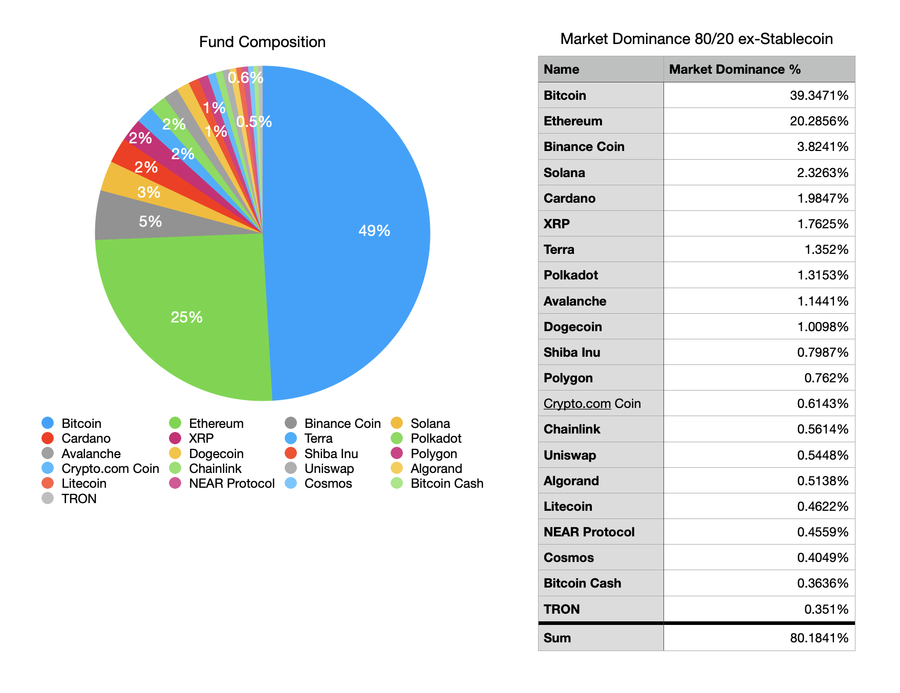

# crypto-index-fund

I was curious if I could build a crypto fund for myself. And it looks like I can. Currently, 80% of the ex-stablecoin crypto market consists of 21 cryptocurrencies. There's few enough that it's possible for one person to buy some of each. Alternatively, one could pick the top 10 crypto currencies, which makes allocation possible with fewer funds.



This repository contains a CLI tool for building your own crypto fund.  It supports the following strategies: 
- Market Dominance Top 10 Coins ex-Stablecoin
- Market Dominance 80% ex-Stablecoin

Happy to add other allocation strategies as well.

If you like this type of project consider [following me on twitter](https://twitter.com/dudzik_eth) to see what else I'm building.

## Installation

Clone the repository and `cd` into it.

```bash
$ git clone https://github.com/doodzik/crypto-index-fund
$ cd $_
$ npm install
```

## Usage

Before getting started make sure to set the `COINMARKET_API_KEY` env variable. You can get the key [here](https://coinmarketcap.com/api/).

```bash
$ export COINMARKET_API_KEY="xxx-xxx-xxx-xxx"
```

When you are in the repository execute the following command.

```bash
$ node ./src/crypto-index-fund.js
```

The output will be something like this:

```javascript
{
  dominance: '80.30%',
  meta: { thresholdDominance: 80, strategyID: 'TOP_80_PERCENT_DOMINANCE' },
  entriesCount: 23,
  entries: [
    {
      dominance: '40.62%',
      symbol: 'BTC',
      name: 'Bitcoin',
      baseCurrency: 'USD',
      price: '$41,938.87',
      distribution: '50.72%',
      amountBaseCurrency: '$11,809.92',
      amount: '₿0.281598431240517422',
      currentHolding: '₿0.534809920691298957',
      changeNominal: '-₿0.253211489450781535',
      changeBaseCurrency: '-$10,619.40'
    },
    // etc...
  ]
}
```

### Flags

#### --strategy=STRING 
specify the strategy to allocate funds
defaults to `TOP_10_COINS`

strategies:
- `TOP_10_COINS`: selects the top 10 coins weighted by market dominance
- `TOP_80_PERCENT_DOMINANCE`: selects the coins constituting 80% of the market dominance

#### --funds=DECIMAL 
specify funds to allocate to the fund
defaults to 1000.0

#### --currency=STRING 
base currency for all conversions 
defaults to USD 

#### --holdings=PATH
add a path to a holdings file in the format that can be seen in `test/holdings.json` file. 
Defaults to empty 

#### --cache=PATH 
takes a path to the marketplace API response data
defaults to false

#### --no-colors/--colors 
Will the output of the output have color encoding
defaults to colors true

## Testing

```bash
$ npm test
```

## Potential Improvements

- [Calculate how to make the least costly rebalancing](https://en.wikipedia.org/wiki/Change-making_problem)


## Disclaimer

The information provided in this repository does not constitute investment advice, financial advice, trading advice, or any other sort of advice and you should not treat any of the repository's content as such. I do not recommend that any cryptocurrency should be bought, sold, or held by you. Do conduct your own due diligence and consult your financial advisor before making any investment decisions.

The data in this repository is provided by CoinMarketCap and I don't take any responsibility for any missing or wrong information. CoinMarketCap provides all information as is. You understand that you are using any and all information available here at your own risk.

Hyperlinks in this repository do not constitute an endorsement, guarantee, warranty, or recommendation by me. Do conduct your own due diligence before deciding to use any third party services.

## License

Copyright (c) The year when you are reading this | Frederik Dudzik

Permission is hereby granted, free of charge, to any person obtaining a copy
of this software and associated documentation files (the "Software"), to deal
in the Software without restriction, including without limitation the rights
to use, copy, modify, merge, publish, distribute, sublicense, and/or sell
copies of the Software, and to permit persons to whom the Software is
furnished to do so, subject to the following conditions:

The above copyright notice and this permission notice shall be included in all
copies or substantial portions of the Software.

THE SOFTWARE IS PROVIDED "AS IS", WITHOUT WARRANTY OF ANY KIND, EXPRESS OR
IMPLIED, INCLUDING BUT NOT LIMITED TO THE WARRANTIES OF MERCHANTABILITY,
FITNESS FOR A PARTICULAR PURPOSE AND NONINFRINGEMENT. IN NO EVENT SHALL THE
AUTHORS OR COPYRIGHT HOLDERS BE LIABLE FOR ANY CLAIM, DAMAGES OR OTHER
LIABILITY, WHETHER IN AN ACTION OF CONTRACT, TORT OR OTHERWISE, ARISING FROM,
OUT OF OR IN CONNECTION WITH THE SOFTWARE OR THE USE OR OTHER DEALINGS IN THE
SOFTWARE.
